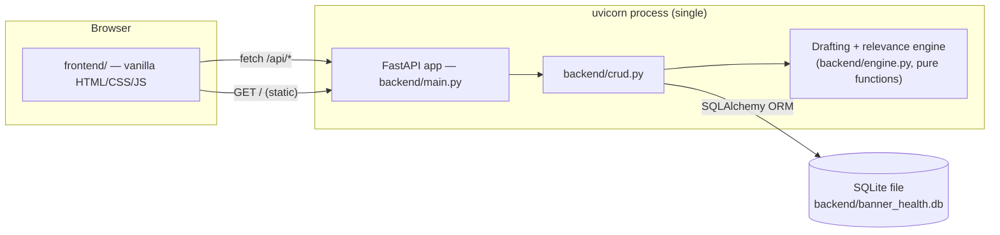
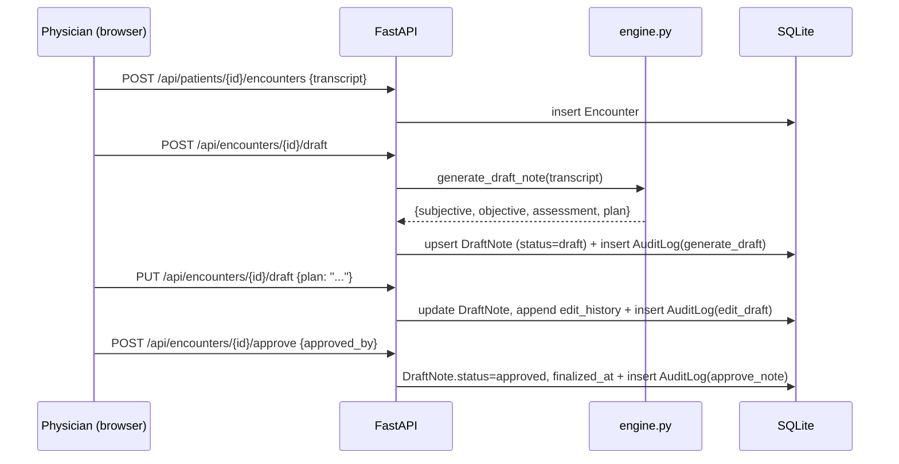

# Architecture

Formalizes the case study's HLD/LLD into the actual system. For exact API/data contracts, see
[`../spec.md`](../spec.md) — this document is about how the pieces fit together, not the field-
level detail.

## Component diagram

One process serves both the API and the static frontend (`StaticFiles` mounted at `/` in
`main.py`, registered *after* the API routes so they aren't shadowed) — there's no separate
frontend server or build step.

## Request flow: the core workflow

Each of the three write actions above is committed to the DB as its own transaction *plus* a
separate audit-log commit — see `performance/PERFORMANCE_REVIEW.md` §Root causes for the cost
implication of that.

## Why these choices

| Decision | Why | Trade-off accepted |
|---|---|---|
| Rule-based drafting/ranking, not a real LLM | Self-contained, offline, deterministic — reproducible in tests and demos | Not real clinical NLP; see `spec.md` §1 |
| SQLite, single file | Zero setup, matches the sibling `eli_lilly_alcoa_app/` convention in this workspace | Single-writer lock caps concurrent write throughput — see performance review |
| One process serves API + static frontend | Simplest possible local/Docker deployment — one port, one command | No CDN/edge caching for static assets; irrelevant at this scale |
| Flat imports in `backend/` (`from database import Base`) | Matches the sibling app's convention; `backend/` is meant to be the import root | `tests/conftest.py` must manually insert `backend/` onto `sys.path` — documented there |
| No auth | Out of scope for a demo (see `spec.md` §7) | Not safe to expose beyond localhost as-is — see `SECURITY.md` |

## Where to look for what

- **API/data contract**: `spec.md`
- **Operational how-to** (start/stop/troubleshoot/backup): `docs/RUNBOOK.md`
- **Performance characteristics and bottlenecks**: `performance/PERFORMANCE_REVIEW.md`
- **How this was built** (which subagent did what): `agents/README.md`
- **Config knobs**: `.env.example`, `backend/config.py`
